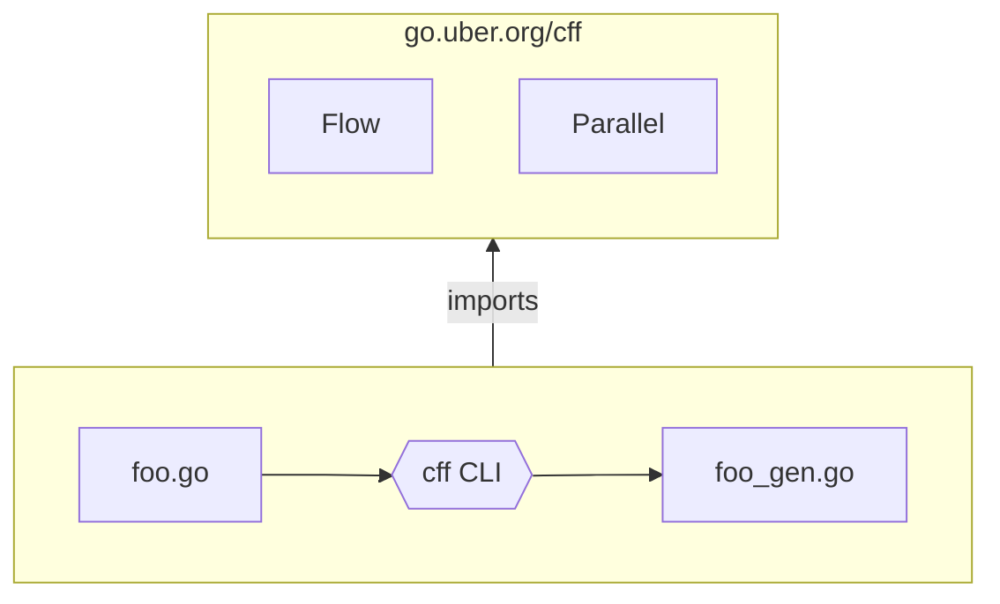
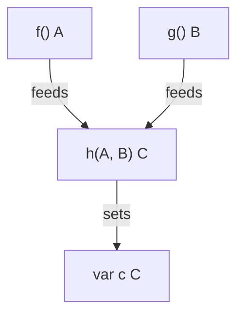

# Architecture

## Overview

cff is comprised of two components:

- the cff command line tool
- the go.uber.org/cff library

The go.uber.org/cff library defines several special functions
that are categorized as **code generation directives**.
Examples of these include `cff.Flow`, `cff.Parallel`, and `cff.Task`.
The implementations of these functions are stubs:
they do not actually do anything useful.

When you write code that uses these functions and run the cff CLI,
it analyzes your code and searches for calls to these functions.
Upon finding them in a file, say `foo.go`,
it makes a mirror copy of that file (`foo_gen.go`)
inside which calls to these directives have been replaced
with code generated by cff.



For example, the following demonstrates how a source file
and its generated variant might look with cff.

```
foo.go                                | foo_gen.go
------------------------------------- | -------------------------------------
//go:build cff                        | //go:build !cff
package foo                           | package foo
                                      |                                       
import (                              | import (                              
  "context"                           |   "context"                           
                                      |                                       
  "go.uber.org/cff"                   |   "go.uber.org/cff"                   
)                                     | )                                     
                                      |                                       
func Bar(ctx context.Context) error { | func Bar(ctx context.Context) error {
  var res Result                      |   var res Result                      
  err := cff.Flow(ctx,                |   err := func() {
    cff.Task(fn1),                    |     x := fn1()
    cff.Task(fn2),                    |     y := fn2()
    // ...                            |     // ...                            
    cff.Results(&res),                |     res = ...
  )                                   |   }()
  if err != nil {                     |   if err != nil {                     
    return err                        |     return err                        
  }                                   |   }                                   
  fmt.Println(res)                    |   fmt.Println(res)                    
}                                     | }                                     
```

::: tip NOTE

cff replaces calls only to code generation directives.
The rest of your code remains unchanged.

:::

## The cff build constraint

Files that use cff's code generation directives are expected
to be tagged with the 'cff' build constraint.
This should be present at the top of the file, before the `package` clause.

```go
//go:build cff

package foo
```

This makes the file invisible to `go build` and `go test`,
because the 'cff' constraint is not set by default.

When you run the cff CLI and it mirrors this file,
it inverts this build constraint in the generated file.

```go
//go:build !cff

package foo
```

This makes the generated file visible to `go build` and `go test`,
and invisible to the cff CLI.

The net effect of this is that when you run the cff CLI,
it'll only see your source files that use code generation directives,
and when you run `go build` or `go test`,
they will only see the files that contain the final generated code.

| Command     | Constraint | Visible file |
|-------------|------------|--------------|
| `cff ./...` | `cff`      | foo.go       |
| `go build`  | `!cff`     | foo_gen.go   |
| `go test`   | `!cff`     | foo_gen.go   |

## Flow graph resolution

Over-simplifying, the resolution of the flow graph works as follows.
Suppose you have three functions:

- `func f() A`
- `func g() B`
- `func h(A, B) C`

When you write code like the following:

```go
var c C
cff.Flow(ctx,
	cff.Task(f),
	cff.Task(g),
	cff.Task(h),
	cff.Results(&c),
)
```

Upon finding the `cff.Flow` call,
cff inspects all provided tasks and builds roughly the following graph:



It then generates code
that schedules these tasks with the cff scheduler,
with dependencies properly specified and connected,
so that `f` and `g` run concurrently,
and when they're both finished, `h` runs with their results.
When `h` finishes, it puts its result into `c`.

## Scheduler

The cff scheduler is a general purpose task scheduler
that uses a standard work-queue model to run tasks
on a bounded number of goroutines.

What's special about it is that it supports dependencies between tasks.
It will not run a task before all the tasks that are marked as its dependencies
have also finished running.
