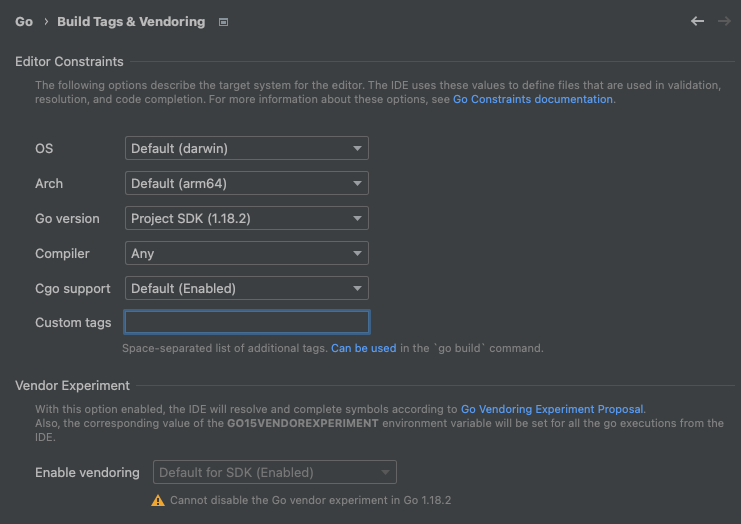
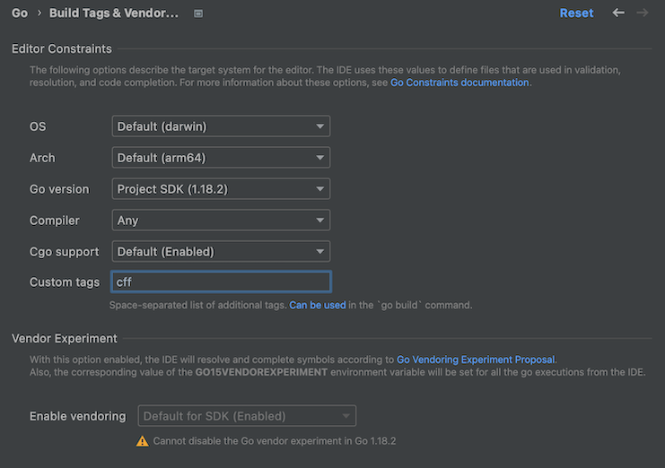

# Editor configuration

To get your editor to behave properly with code that uses cff,
you need to add `-tags cff` to your build tags.

The instructions for this vary on which editor you're using.

[[toc]]

## gopls

Most editor integrations with vim, emacs, neovim, and VSCode use
[gopls](https://github.com/golang/tools/blob/master/gopls/README.md).

With gopls, you have to set the
[buildFlags setting](https://github.com/golang/tools/blob/master/gopls/doc/settings.md#buildflags-string)
to `["-tags", "cff"]`.

Editor-specific instructions for gopls follow.

### VSCode

If you're using VSCode:

1. Locate the gopls configuration section in your `settings.json`.
   It might look like this:

   ```json
   "gopls": {
     ...
   }
   ```

2. Configure `build.buildFlags` to set the cff tag.

   ```json
   "gopls": {
     ...
     "build.buildFlags": ["-tags", "cff"]
   }
   ```

### vim-go

If you're using vim-go, add the following to your `.vimrc`.

```vim
let g:go_build_tags = 'cff'
```

### nvim-lspconfig

If you're using Neovim's built-in LSP client with
[nvim-lspconfig](https://github.com/neovim/nvim-lspconfig):

1. Locate the `gopls.setup` call in your `init.vim` or `.vimrc`.
   It should look similar to one of the following:

   ```lua
   require('lspconfig')['gopls'].setup {
     -- ...
   }
   ```

2. Add a `settings.gopls` section to it if it doesn't already exist,
   and configure `buildFlags` to set the cff tag.

   ```lua
   require('lspconfig')['gopls'].setup {
     -- ...
     settings = {
       gopls = {
         buildFlags = {'-tags', 'cff'},
       },
     },
   }
   ```

## JetBrains GoLand

1. Go to: **Preferences** > **Go** > **Build Tags & Vendoring**.

   

2. Set **Custom tags** to "cff"

   
