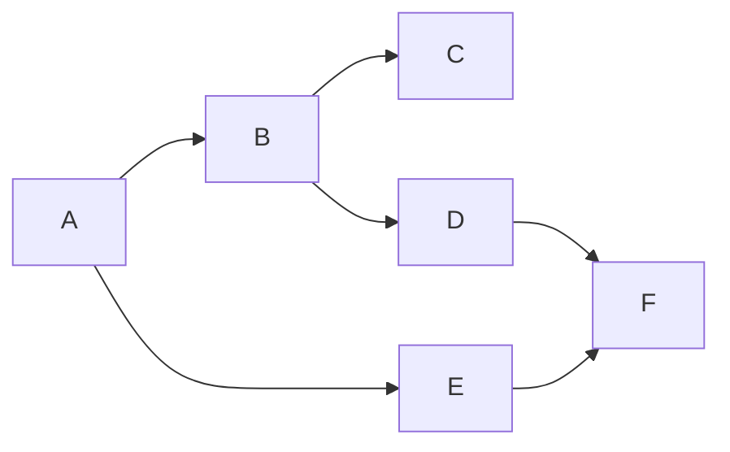

# FAQ

[[toc]]

## Should I use Flow or Parallel?

Flow runs **interdependent** tasks.
That is, the output of a task is typically the input of another,
with very few leaf tasks--tasks whose outputs are consumed with `cff.Results`.



Parallel, on the other hand, runs **independent** tasks.
If you find yourself managing groups of goroutines with `sync.WaitGroup`,
consider using `cff.Parallel` instead.

```go
// Before
var wg sync.WaitGroup
for _, url := range urls {
	wg.Add(1)
	go func(url string) {
		defer wg.Done()

		res, err := http.Get(url)
		// ...
	}(url)
}

// After
cff.Parallel(ctx,
	cff.Slice(func(url string) error {
		res, err := http.Get(url)
		// ...
	}, urls),
)
```

See also [What can I use cff for?](use-cases.md).

## Does `cff.Flow` allow multiple values of the same type?

No, `cff.Flow` does not yet allow multiple values of the same type
to be returned by different tasks.
Each type must be returned by exactly one task in the flow.

If you have need of this, you can work around this limitation
by defining temporary type wrappers around the return type
and casting to those values within the flow.

```go
// Given,
//   func (*UserClient) GetUser(...) (*User, error)

// Define wrappers for the different kinds of User objects we need.
type (
  RiderUser  User
  DriverUser User
)

err := cff.Flow(ctx,
  // ...
  cff.Task(func(...) (*RiderUser, error) {
    u, err := userClient.GetUser(...)
    return (*RiderUser)(u)
  }),
  cff.Task(func(...) (*DriverUser, error) {
    u, err := userClient.GetUser(...)
    return (*DriverUser)(u)
  }),
)
```
