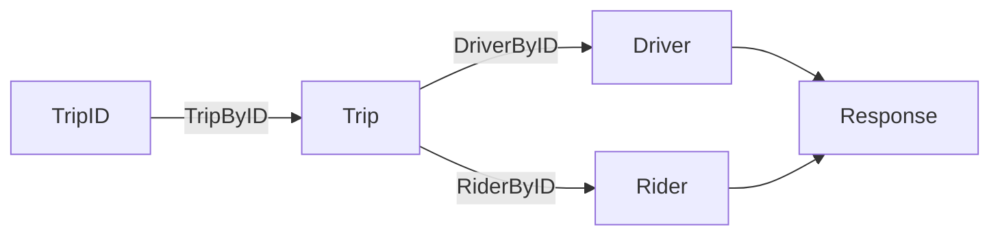

# Your first cff flow

## Set up a fake API

For the demo, we'll make a fake service to send requests to
instead of using a real system.

1. Create a new file in your demo project named "api.go".
   Inside it, put the following interface.

   ```go mdox-exec='region ex/get-started/flow/api.go api-def'
   type UberAPI interface {
   	DriverByID(string) (*Driver, error)
   	RiderByID(string) (*Rider, error)
   	TripByID(string) (*Trip, error)
   }

   type Driver struct {
   	ID   string
   	Name string
   }

   type Rider struct {
   	ID   string
   	Name string
   }

   type Trip struct {
   	ID       string
   	DriverID string
   	RiderID  string
   }
   ```

   This defines a pretty simple interface for a conceivable
   Uber API client:

   - there are three resources: driver, rider, trip
   - the `*ById` methods support retrieving them by ID
   - trips have a driver and a rider

   This is obviously simplified, but it will suffice for the demo.

2. In the same file, or a new file, add the following fake implementation
   of this interface.

   ```go mdox-exec='region ex/get-started/flow/api.go impl'
   type fakeUberClient struct{}

   func (*fakeUberClient) TripByID(id string) (*Trip, error) {
   	time.Sleep(200 * time.Millisecond)
   	return &Trip{
   		ID:       id,
   		DriverID: "42",
   		RiderID:  "57",
   	}, nil
   }

   func (*fakeUberClient) DriverByID(id string) (*Driver, error) {
   	time.Sleep(500 * time.Millisecond)
   	return &Driver{
   		ID:   id,
   		Name: "Eleanor Nelson",
   	}, nil
   }

   func (*fakeUberClient) RiderByID(id string) (*Rider, error) {
   	time.Sleep(300 * time.Millisecond)
   	return &Rider{
   		ID:   id,
   		Name: "Richard Dickson",
   	}, nil
   }
   ```

   Note that the `DriverByID` and `RiderByID` operations
   take 500 and 300 milliseconds each.

## Write the flow

Now let's actually make requests to this interface.

1. In your main.go, instantiate the fake client to send requests to.

   ```go mdox-exec='region ex/get-started/flow/main.go fake-client'
   var uber UberAPI = new(fakeUberClient)
   ```

2. Start a new flow by calling `cff.Flow` with a context argument.
   We'll create one with a timeout here.

   ```go mdox-exec='region ex/get-started/flow/main.go main ctx flow-start'
   func main() {
     ctx, cancel := context.WithTimeout(context.Background(), time.Second)
     defer cancel()
     err := cff.Flow(ctx,
   ```

3. Add a task to the flow to retrieve information about the trip.

   ```go mdox-exec='region ex/get-started/flow/main.go flow-start get-trip'
     err := cff.Flow(ctx,
       cff.Task(func(tripID string) (*Trip, error) {
         return uber.TripByID(tripID)
       }),
   ```

4. The task we just added expects the trip ID to be present in a string.
   Let's give it that.
   Add a `cff.Params` call to provide the trip ID for this function.

   ```go mdox-exec='region ex/get-started/flow/main.go flow-start params get-trip'
     err := cff.Flow(ctx,
       cff.Params("1234"),
       cff.Task(func(tripID string) (*Trip, error) {
         return uber.TripByID(tripID)
       }),
   ```

   The order in which this is passed to `cff.Flow` does not matter.

5. With a trip object available, the flow can run other operations.
   Add two new tasks: one to fetch the driver, and one to fetch the rider,
   given a trip.

   ```go mdox-exec='region ex/get-started/flow/main.go get-trip get-driver get-rider'
       cff.Task(func(tripID string) (*Trip, error) {
         return uber.TripByID(tripID)
       }),
       cff.Task(func(trip *Trip) (*Driver, error) {
         return uber.DriverByID(trip.DriverID)
       }),
       cff.Task(func(trip *Trip) (*Rider, error) {
         return uber.RiderByID(trip.RiderID)
       }),
   ```

   Again, the order in which these are provided does not matter.

6. At this point, we have two independent tasks: DriverByID and RiderByID,
   fetching information about a driver and a rider respectively.
   Let's bring them together. Declare a new `Response` type.

   ```go mdox-exec='region ex/get-started/flow/main.go resp-decl'
   type Response struct {
   	Rider  string
   	Driver string
   }
   ```

7. Back in the flow, add a new task to build the Response.

   ```go mdox-exec='region ex/get-started/flow/main.go flow-start last-task'
     err := cff.Flow(ctx,
       // ...
       cff.Task(func(r *Rider, d *Driver) *Response {
         return &Response{
           Driver: d.Name,
           Rider:  r.Name,
         }
       }),
   ```

8. Run `go generate`. You'll see an error similar to the following:

   ```
   main.go:59:12: unused output type *[..].Response
   ```

   In cff, the results of a task must be consumed by another task or by a
   `cff.Results` directive which extracts values from a flow.
   Let's fix this.

9. Declare a new `*Response` variable and pass a pointer to it to
   `cff.Results`.
   This tells cff to fill that pointer with a value from the flow.

   ```go mdox-exec='region ex/get-started/flow/main.go flow-start resp-var'
     var res *Response
     err := cff.Flow(ctx,
       cff.Params("1234"),
       cff.Results(&res),
       cff.Task(func(tripID string) (*Trip, error) {
   ```

   As with previous cases--the position of `cff.Results` in the `cff.Flow` call
   does not matter.

10. Finally, handle the error returned by `cff.Flow`
    and print the response.

    ```go mdox-exec='region ex/get-started/flow/main.go tail'
        cff.Task(func(r *Rider, d *Driver) *Response {
          return &Response{
            Driver: d.Name,
            Rider:  r.Name,
          }
        }),
      )
      if err != nil {
        log.Fatal(err)
      }

      fmt.Println(res.Driver, "drove", res.Rider)
    ```

11. Finally, run `go generate` again.
    You should see a message similar to the following.

    ```
    Processed 3 files with 0 errors
    ```

12. Run `go run .` to run the program.

    ```
    % go run .
    Eleanor Nelson drove Richard Dickson
    ```

**What did we just do?**

After the setup in the first section,
we build a cff flow with four tasks:
TripByID, DriverByID, RiderByID,
and the final task to build a Response.

These together form the following graph.



`DriverByID` and `RiderByID` are independent of each other
so as soon as the trip information is available,
cff runs them both concurrently.
When both their results are available,
cff runs the function to build `Response`.

Although this was a simple graph example,
cff can handle graphs that are significantly more complex:
more than it would be reasonable for a person to manually orchestrate
concurrency for.
