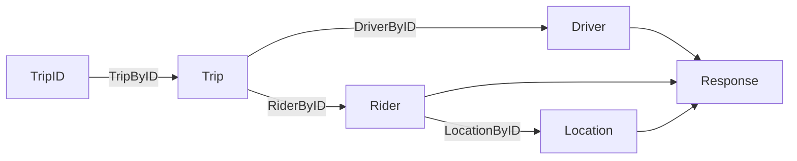

# Your first cff flow

## Set up a fake API

For the demo, we'll make a fake service to send requests to
instead of using a real system.

1. Create a new file in your demo project named "api.go".
   Inside it, put the following interface.

   ```go mdox-exec='region ex/get-started/flow/api.go api-def'
   type UberAPI interface {
   	DriverByID(int) (*Driver, error)
   	RiderByID(int) (*Rider, error)
   	TripByID(int) (*Trip, error)
   	LocationByID(int) (*Location, error)
   }

   type Driver struct {
   	ID   int
   	Name string
   }

   type Location struct {
   	ID    int
   	City  string
   	State string
   	// ...
   }

   type Rider struct {
   	ID     int
   	Name   string
   	HomeID int
   }

   type Trip struct {
   	ID       int
   	DriverID int
   	RiderID  int
   }
   ```

   This defines a pretty simple interface for a conceivable
   Uber API client:

   - there are four resources: driver, rider, trip, location
   - the `*ById` methods support retrieving them by ID
   - trips have a driver and a rider
   - riders have a home location

   This is obviously oversimplified, but it will suffice for the demo.

2. In the same file, or a new file, add the following fake implementation
   of this interface.

   ```go mdox-exec='region ex/get-started/flow/api.go impl'
   type fakeUberClient struct{}

   func (*fakeUberClient) DriverByID(id int) (*Driver, error) {
   	time.Sleep(500 * time.Millisecond)
   	return &Driver{
   		ID:   id,
   		Name: "Eleanor Nelson",
   	}, nil
   }

   func (*fakeUberClient) LocationByID(id int) (*Location, error) {
   	time.Sleep(200 * time.Millisecond)
   	return &Location{
   		ID:    id,
   		City:  "San Francisco",
   		State: "California",
   	}, nil
   }

   func (*fakeUberClient) RiderByID(id int) (*Rider, error) {
   	time.Sleep(300 * time.Millisecond)
   	return &Rider{
   		ID:   id,
   		Name: "Richard Dickson",
   	}, nil
   }

   func (*fakeUberClient) TripByID(id int) (*Trip, error) {
   	time.Sleep(150 * time.Millisecond)
   	return &Trip{
   		ID:       id,
   		DriverID: 42,
   		RiderID:  57,
   	}, nil
   }
   ```

   Note that the different `*ByID` operations take different amounts of time.

## Write the flow

Now let's actually make requests to this interface.

1. Create a `main.go` and put a `//go:build cff` comment at the top it.
   This is necessary for cff to be able to process this file.

   ```go mdox-exec='region ex/get-started/flow/main.go directive'
   //go:build cff

   package main
   ```

2. Elsewhere in the file, instantiate the fake client to send requests to.

   ```go mdox-exec='region ex/get-started/flow/main.go fake-client'
   var uber UberAPI = new(fakeUberClient)
   ```

3. Declare a `main()` and set up a `context.Context` with a one second timeout.
   We'll use this in our flow.

   ```go mdox-exec='region ex/get-started/flow/main.go main ctx'
   func main() {
     ctx, cancel := context.WithTimeout(context.Background(), time.Second)
     defer cancel()
   ```

4. Now start a new flow by calling `cff.Flow` with the context.

   ```go mdox-exec='region ex/get-started/flow/main.go main ctx flow-start'
   func main() {
     ctx, cancel := context.WithTimeout(context.Background(), time.Second)
     defer cancel()
     err := cff.Flow(ctx,
   ```

5. Add a task to the flow to retrieve information about the trip.

   ```go mdox-exec='region ex/get-started/flow/main.go flow-start get-trip'
     err := cff.Flow(ctx,
       cff.Task(func(tripID int) (*Trip, error) {
         return uber.TripByID(tripID)
       }),
   ```

6. The task we just added expects the trip ID to be present in an integer.
   Let's give it that.
   Add a `cff.Params` call to provide the trip ID for this function.

   ```go mdox-exec='region ex/get-started/flow/main.go flow-start params get-trip'
     err := cff.Flow(ctx,
       cff.Params(12),
       cff.Task(func(tripID int) (*Trip, error) {
         return uber.TripByID(tripID)
       }),
   ```

   The order in which this is passed to `cff.Flow` does not matter.

7. With a trip object available, the flow can run other operations.
   Add two new tasks that, given a trip,
   will fetch the driver and the rider for that trip respectively.

   ```go mdox-exec='region ex/get-started/flow/main.go flow-start flow-dots get-driver get-rider'
     err := cff.Flow(ctx,
       // ...
       cff.Task(func(trip *Trip) (*Driver, error) {
         return uber.DriverByID(trip.DriverID)
       }),
       cff.Task(func(trip *Trip) (*Rider, error) {
         return uber.RiderByID(trip.RiderID)
       }),
   ```

   Again, the order in which these are provided does not matter.

8. One of the tasks we just added fetches information about a rider.
   Add another task that retrieves the rider's location.

   ```go mdox-exec='region ex/get-started/flow/main.go flow-start flow-dots get-location'
     err := cff.Flow(ctx,
       // ...
       cff.Task(func(rider *Rider) (*Location, error) {
         return uber.LocationByID(rider.HomeID)
       }),
   ```

9. We now have a few different tasks. Let's bring their results together.
   Declare a new `Response` type.

   ```go mdox-exec='region ex/get-started/flow/main.go resp-decl'
   type Response struct {
   	Rider    string
   	Driver   string
   	HomeCity string
   }
   ```

10. Back in the flow, add a new task to build the Response
    from the outputs of the different tasks.

    ```go mdox-exec='region ex/get-started/flow/main.go flow-start flow-dots last-task'
      err := cff.Flow(ctx,
        // ...
        cff.Task(func(r *Rider, d *Driver, home *Location) *Response {
          return &Response{
            Driver:   d.Name,
            Rider:    r.Name,
            HomeCity: home.City,
          }
        }),
    ```

11. Handle the error returned by `cff.Flow`.
    For the tutorial, we're just exiting the application.
    In a real application, you should handle this error more gracefully.

    ```go mdox-exec='region ex/get-started/flow/main.go error'
        cff.Task(func(r *Rider, d *Driver, home *Location) *Response {
          return &Response{
            Driver:   d.Name,
            Rider:    r.Name,
            HomeCity: home.City,
          }
        }),
      )
      if err != nil {
        log.Fatal(err)
      }
    ```

12. Run `go generate`. You'll see an error similar to the following:

    ```
    main.go:59:12: unused output type *[..].Response
    ```

    In cff, the results of a task must be consumed by another task
    or by a `cff.Results` directive which extracts values from a flow.
    Let's fix this.

13. Declare a new `*Response` variable above the `cff.Flow` call,
    and use `cff.Results` to pass a reference to it to the flow.
    This tells cff to fill that pointer with a value from the flow.

    ```go mdox-exec='region ex/get-started/flow/main.go flow-start resp-var'
      var res *Response
      err := cff.Flow(ctx,
        cff.Params(12),
        cff.Results(&res),
        cff.Task(func(tripID int) (*Trip, error) {
    ```

    As with previous cases--the position of `cff.Results` in the `cff.Flow` call
    does not matter.

14. Print the response after handling the error.

    ```go mdox-exec='region ex/get-started/flow/main.go tail'
    	if err != nil {
    		log.Fatal(err)
    	}

    	fmt.Println(res.Driver, "drove", res.Rider, "who lives in", res.HomeCity)
    ```


15. Finally, run `go generate` again.
    You should see a message similar to the following.

    ```
    Processed 3 files with 0 errors
    ```

16. Run the program with `go run .`:

    ```
    % go run .
    Eleanor Nelson drove Richard Dickson who lives in San Francisco
    ```

**What did we just do?**

After the setup in the first section,
we build a cff flow with five tasks:
TripByID, DriverByID, RiderByID, LocationByID,
and the final task to build a Response.

These together form the following graph.



- `DriverByID` and `RiderByID` are independent of each other
  so as soon as the trip information is available,
  cff runs them both concurrently.
- When the rider information is available, `DriverByID` is still running,
  so cff runs `LocationByID` concurrently.
- When they're both finished,
  cff finally brings the results together in `Response`.

Although the graph in this example is contrived,
cff can and does handle graphs that are significantly more complex:
more than it would be reasonable for a person to manually orchestrate
concurrency for.

**Next steps**

- Explore the [API Reference](https://pkg.go.dev/go.uber.org/cff)

<!-- TODO: another tutorial on using cff.Parallel should be linked here. -->
